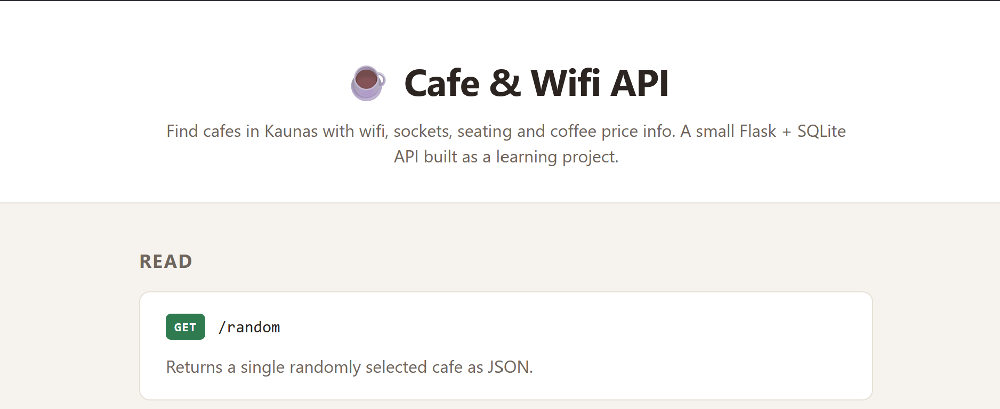

# Cafe & Wifi API

A Flask REST API that serves data about cafes in Kaunas, Lithuania (wifi
availability, sockets, seating, coffee price, etc.) from a SQLite database.

## Screenshot



## Features

- `GET /` - renders a styled documentation homepage (`templates/index.html`)
  listing every endpoint below, grouped by Read/Create/Update/Delete.
- `GET /random` - returns a single random cafe as JSON.
- `GET /all` - returns every cafe in the database as JSON, sorted by name.
- `GET /search?location=<location>` - returns cafes matching the given
  `location` query param as JSON, or a 404 with an error message if none
  match.
- `POST /add` - creates a new cafe from form-encoded fields (`name`,
  `map_url`, `img_url`, `location`, `seats`, `sockets`, `toilet`, `wifi`,
  `calls`, `coffee_price`) and returns a success message. `name`,
  `map_url`, `img_url`, `location`, and `seats` are required.
- `PATCH /update-price/<cafe_id>?new_price=<price>` - updates a cafe's
  coffee price, or returns a 404 if the id doesn't exist.
- `DELETE /report-closed/<cafe_id>?api_key=<key>` - deletes a cafe (e.g.
  to report it closed down), or returns a 404 if the id doesn't exist or
  the key is wrong. Requires an `API_KEY` environment variable (see
  Known Issues for what happens if it's not set).
- SQLite database (`instance/cafes.db`) accessed through Flask-SQLAlchemy,
  with a `Cafe` model covering name, map URL, image URL, location, seat
  count, wifi/sockets/toilet/call availability, and coffee price.
- `seed_data.py` populates the database with 14 real cafes from Kaunas.

## How to Run

1. Create and activate a virtual environment.
2. Install dependencies:
   ```
   pip install -r requirements.txt
   ```
3. Copy `.env.example` to `.env` and set `API_KEY` to a value of your
   choice (required for `/report-closed` to actually check the key).
4. (Optional, first run only) Seed the database with sample cafes:
   ```
   python seed_data.py
   ```
5. Start the server:
   ```
   python main.py
   ```
6. Visit `http://127.0.0.1:5000/` in a browser for an overview of every
   endpoint, or hit `/random` and `/all` directly to get JSON data.

## Known Issues / Limitations

- No input validation, authentication, or error handling (e.g. `/random`
  will raise an error if the cafes table is empty, and `/add` will raise
  a 500 `IntegrityError` if a required field like `img_url`, `location`,
  or `seats` is missing from the request, instead of returning a clean
  error response).
- If `.env` doesn't exist (so `API_KEY` is unset), `/report-closed`'s key
  check becomes `None != None`, which is `False` - so a request that
  omits `api_key` entirely passes the check and deletes the cafe anyway,
  with no key required at all.
- `requirements.txt` is UTF-16 encoded (artifact of how it was generated),
  which is unusual but still parses fine with `pip install -r`.

## What I Learned

- Setting up Flask-SQLAlchemy with the newer `Mapped`/`mapped_column`
  typed declarative style instead of the older `db.Column` syntax.
- Converting a SQLAlchemy model instance to JSON with a reusable
  `to_dict()` method that iterates over `self.__table__.columns`.
- Using `db.session.execute(db.select(...))` with `.scalars().all()` to
  fetch rows in SQLAlchemy 2.x style, instead of the legacy `Model.query`
  API.
- Got a `405 Method Not Allowed` testing `/add` by pasting the URL into
  a browser address bar, which always sends `GET`. Fixed by switching to
  Postman, setting the method to `POST`, and sending the body as
  `x-www-form-urlencoded` (matching `request.form.get(...)` in the
  route) instead of raw JSON.
- Got a `sqlite3.IntegrityError: NOT NULL constraint failed` on `/add`
  when the POST body left out required fields (`img_url`, then
  `location`, then `seats`). Fixed by including every column marked
  `nullable=False` on the `Cafe` model in the form body; `coffee_price`
  is the only field that's actually optional.
- Found that `bool(request.form.get("wifi"))` isn't a real boolean
  check: any non-empty string, including `"false"` or `"no"`, is truthy
  in Python, so it always evaluated to `True` unless the form key was
  left out entirely. Fixed by adding a `parse_form_bool()` helper that
  checks the value against a set of recognized truthy strings instead
  of relying on Python's string truthiness.
